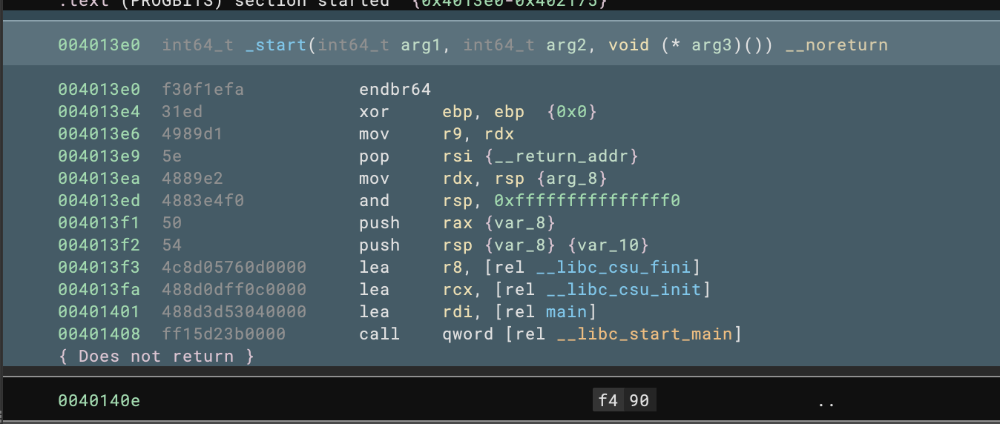

# Simple-Coverage
Author: **ch4rli3kop**

A plugin that highlights instruction addresses

## Description:

Load the file whose contents are the command addresses as follows.
```
0x4013e0
0x4013e4
0x4013e6
0x4013e9
0x4013ea
0x4013ed
0x4013f1
...
```

Then that will be highlighted!



## License

This plugin is released under an [MIT license](./license).
